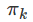

# 非监督学习（Unsupervised-learning）

## 距离计算
  

  

## 聚类
硬聚类：把数据确切地分到某一类中，是属于A类就是A类，不会跑到B类；比如K-Means。    
软聚类/模糊聚类(fuzzy clustering）:把数据以一定的概率分到各类中,聚类的结果往往是样本1在A类的概率是0.7，在B类的概率是0.3;比如高斯混合模型(GMM)，比如模糊C均值模型(Fuzzy c-Means)。  

### K-Means(K均值)
K-Means 是一种基于距离的排他的聚类划分方法；K-means算法是硬聚类算法，以欧式距离作为相似度测度，它是求对应某一初始聚类中心向量V最优分类，使得评价指标J最小。算法采用误差平方和准则函数作为聚类准则函数。K表示聚类数目。  

K-Means中几个概念：
> **聚类（Clustering）：** K-Means 是一种聚类分析（Cluster Analysis）方法。聚类就是将数据对象分组成为多个类或者簇 (Cluster)，使得在同一个簇中的对象之间具有较高的相似度，而不同簇中的对象差别较大。  
> **划分（Partitioning）：** 聚类可以基于划分，也可以基于分层。划分即将对象划分成不同的簇，而分层是将对象分等级。  
> **排他（Exclusive）：** 对于一个数据对象，只能被划分到一个簇中。如果一个数据对象可以被划分到多个簇中，则称为可重叠的（Overlapping）。  
> **距离（Distance）：** 基于距离的聚类是将距离近的相似的对象聚在一起。基于概率分布模型的聚类是在一组对象 中，找到能符合特定分布模型的对象的集合，他们不一定是距离最近的或者最相似的，而是能完美的呈现出概率分布模型所描述的模型。  


算法描述：  
> 选择K个点作为初始质心  
> repeat  
>     将每个点指派到最近的质心，形成K个簇  
>     重新计算每个簇的质心  
> until 簇不发生变化或达到最大迭代次数  

K-Means优缺点：  
> **优点：**   
> 1. 当结果簇是密集的，而且簇和簇之间的区别比较明显时，K-Means 的效果较好；  
> 2. 对于大数据集，K-Means 是相对可伸缩的和高效的，它的复杂度是 O(nkt)，n 是对象的个数，k 是簇的数目，t 是迭代的次数；  
> 3. 适用于高维。  
> 
> **缺点：**   
> 1. 要求先给出 k 的个数。k 的选择一般基于经验值和多次实验结果，对于不同的数据集，k 的取值没有可借鉴性；  
> 2. K-Means 对孤立点数据是敏感的，少量噪声数据就能对平均值造成极大的影响。   
> 3. K-Means非常依赖于聚类中心点初始化的位置，不同的初始点选择可能导致完全不同的聚类结果。   

## 层次聚类和密度聚类
### 层次聚类
层次聚类算法分成凝聚的和分裂的两种，取决于层次分解是以自底向上(合并)还是以自顶向下(分裂)方式形成
凝聚的层次聚类方法使用自底向上的策略，开始时每个对象自己是独立的类(N个)，然后不断合并成越来越大的类，直到所有的对象都在一个类中，或者满足某个终止条件。在合并过程中是找出两个最近的类让他们合并形成一个类，所以最多进行N次迭代就将所有对象合并到一起了。分裂的层次聚类方法使用自顶向下的策略，开始时所有对象都在一个类中(1个)，然后不断的划分成更小的类，直到最小的类都足够凝聚或者只包含一个对象  

#### 凝聚的层次聚类算法
输入：给定要聚类的N个对象以及N*N的距离矩阵(或者是相似性矩阵)  
步骤：  
1.  将每个对象归为一类, 共得到N类, 每类仅包含一个对象. 类与类之间的距离就是它们所包含的对象之间的距离.  
2.  找到最接近的两个类并合并成一类, 于是总的类数少了一个.   
3.  重新计算新的类与所有旧类之间的距离.   
4.  重复第2步和第3步, 直到最后合并成一个类为止(此类包含了N个对象)或满足一定条件终止  

根据步骤3的不同, 可将层次式聚类方法分 **单连接算法(single-linkage)** 、 **全连接算法(complete-linkage)** 以及 **平均连接（average-linkage）**  --参考上面cluster距离计算方式。  

代码实现：Hierarchical-Clustering/Hierarchical Clustering Lab-zh.ipynb  

#### 分裂的层次聚类算法
待补充  

层次聚类的优缺点：  
> **优点：**   
> 1. 分层表示可以提供非常有用的信息  
> 2. 把数据集的聚类结构视觉化  
> 3. 当数据集包含真正的层次关系时(例如，进化生物学)尤其有效。  
>   
> ** 缺点： **  
> 1. 对噪声和离群值很敏感  
> 2. 计算量大 O(N平方)  

### 密度聚类
假设聚类结构能通过样本分布的紧密程度确定，密度聚类算法从样本密度的角度来考察样本之间的可连接性，并基于可连接样本不断扩展聚类簇，以获得最终的聚类结果。  

#### DBSCAN
DBSCAN是一种基于密度的聚类算法，这类密度聚类算法一般假定类别可以通过样本分布的紧密程度决定。同一类别的样本，他们之间的紧密相连的，也就是说，在该类别任意样本周围不远处一定有同类别的样本存在。  

通过将紧密相连的样本划为一类，这样就得到了一个聚类类别。通过将所有各组紧密相连的样本划为各个不同的类别，则我们就得到了最终的所有聚类类别结果。  

DBSCAN中几个概念：  
> 假设我的样本集是D=(x1,x2,...,xm),则DBSCAN具体的密度描述定义如下：  
> 1. ϵ-邻域：对于xj∈D，其ϵ-邻域包含样本集D中与xj的距离不大于ϵ的子样本集，即Nϵ(xj)={xi∈D|distance(xi,xj)≤ϵ}, 这个子样本集的个数记为|Nϵ(xj)|　  
> 2. 核心对象：对于任一样本xj∈D，如果其ϵ-邻域对应的Nϵ(xj)至少包含MinPts个样本，即如果|Nϵ(xj)|≥MinPts，则xj是核心对象。　  
> 3. 密度直达：如果xi位于xj的ϵ-邻域中，且xj是核心对象，则称xi由xj密度直达。注意反之不一定成立，即此时不能说xj由xi密度直达, 除非且xi也是核心对象。  
> 4. 密度可达：对于xi和xj,如果存在样本样本序列p1,p2,...,pT,满足p1=xi,pT=xj, 且pt+1由pt密度直达，则称xj由xi密度可达。也就是说，密度可达满足传递性。此时序列中的传递样本p1,p2,...,pT−1均为核心对象，因为只有核心对象才能使其他样本密度直达。注意密度可达也不满足对称性，这个可以由密度直达的不对称性得出。  
> 5. 密度相连：对于xi和xj,如果存在核心对象样本xk，使xi和xj均由xk密度可达，则称xi和xj密度相连。注意密度相连关系是满足对称性的。  

算法：  
> 输入：样本集D=(x1,x2,...,xm)，邻域参数(ϵ,MinPts), 样本距离度量方式  
> 
> 输出： 簇划分C.　  
> 
> 1）初始化核心对象集合Ω=∅, 初始化聚类簇数k=0，初始化未访问样本集合Γ = D,  簇划分C = ∅  
> 2) 对于j=1,2,...m, 按下面的步骤找出所有的核心对象：  
>     a) 通过距离度量方式，找到样本xj的ϵ-邻域子样本集Nϵ(xj)  
>     b) 如果子样本集样本个数满足|Nϵ(xj)|≥MinPts， 将样本xj加入核心对象样本集合：Ω=Ω∪{xj}  
> 3）如果核心对象集合Ω=∅，则算法结束，否则转入步骤4.  
> 4）在核心对象集合Ω中，随机选择一个核心对象o，初始化当前簇核心对象队列Ωcur={o}, 初始化类别序号k=k+1，初始化当前簇样本集合Ck={o}, 更新未访问样本集合Γ=Γ−{o}  
> 5）如果当前簇核心对象队列Ωcur=∅，则当前聚类簇Ck生成完毕, 更新簇划分C={C1,C2,...,Ck}, 更新核心对象集合Ω=Ω−Ck， 转入步骤3。  
> 6）在当前簇核心对象队列Ωcur中取出一个核心对象o′,通过邻域距离阈值ϵ找出所有的ϵ-邻域子样本集Nϵ(o′)，令Δ=Nϵ(o′)∩Γ, 更新当前簇样本集合Ck=Ck∪Δ, 更新未访问样本集合Γ=Γ−Δ,  更新Ωcur=Ωcur∪(Nϵ(o′)∩Ω)，转入步骤5.  
> 
> 输出结果为： 簇划分C={C1,C2,...,Ck}  

DBSCAN优点和缺点：  
> **优点：**
> 1. 不需要指明类的数量  
> 2. 能灵活的找到并分离各种形状和大小的类  
> 3. 能够强有力的处理数据集中的噪声和离群值  
>   
> **缺点：**  
> 1. 从两个集群中可到达的边界点，被分配到哪个集群存在不确定性  
> 2. 找到不同密度的类方面有一定的困难  
> 3. 密度聚类使用DBCV评价模型  

DBSCAN实现:DBSCAN/DBSCAN Notebook-zh.ipynb   

### SOM神经网络
待补充  

## 高斯混合模型(GMM)与聚类验证
### 高斯混合模型(GMM)
高斯分布：即正态分布  
高斯混合模型（Gaussian Mixed Model）指的是多个高斯分布函数的线性组合  

公式表示为：  
  
其中称为混合模型中的第k个分量（component）,是混合系数（mixture coefficient），且满足  
  
  

二维高斯分布：  
  

期望最大化算法--EM算法（Expectation-Maximization algorithm）：  
> 1.初始化K个高斯分布  
> 2.将数据软聚类成我们初始化的K个高斯分布（期望步/E步）  
> 3.基于软聚类重新估计高斯模型参数（最大化步/M步）  
> 4.如果收敛，结束，如果不收敛，返回第二步  
> 第一步：  
> 使用K-Means协方差聚类初始化高斯混合模型  
> 第二步：  
>   
> 第三步：  
>   
>   
> 第四步：  
>   

高斯混合聚类优缺点：  
> **优点：**  
> 1. 提供了软聚类  
> 2. 聚类外观方面很具灵活性  
>   
> **缺点：**  
> 1. 对初始值很敏感  
> 2. 可能收敛到局部最优  
> 3. 收敛速度慢	  


sklearn中使用GMM  
```
from sklearn import datasets,mixture

# Load dataset
X =  datasets.load_iris().data[:10]

gmm = mixture.GaussianMixture(n_components=3)
gmm.fit(X)
clustering = gmm.predict(X)
```

## 特征缩放(Feature scaling)
特征缩放是用来标准化数据特征的范围，特征缩放是针对多特征情况的。当有多个特征向量的时候，如果其中一个变化范围比较大，该特征向量的参数可能会变化范围很大，从而主导整个梯度下降的过程，因此每个特征应该被归一化，比如将取值范围处理为0到1之间  

特征缩放方法：  
1. 调节比例（Rescaling）  
	  
2. 标准化(Standardization)  
	  

在sklearn中使用特征缩放  
```
from sklearn.preprocessing import MinMaxScaler
data = [[-1, 2], [-0.5, 6], [0, 10], [1, 18]]
scaler = MinMaxScaler()
scaler.fit(data)
print(scaler.transform(data))

> [[ 0.    0.  ]
 [ 0.25  0.25]
 [ 0.5   0.5 ]
 [ 1.    1.  ]]
```

**特征缩放对使用RBF核的SVM和K-均值聚类有较大影响**  

## 主成分分析（PCA）
降维是对数据高维度特征的一种预处理方法。降维是将高维度的数据保留下最重要的一些特征，去除噪声和不重要的特征，从而实现提升数据处理速度的目的。在实际的生产和应用中，降维在一定的信息损失范围内，可以为我们节省大量的时间和成本。降维也成为了应用非常广泛的数据预处理方法。  

PCA(principal Component Analysis)，即主成分分析方法，是一种使用最广泛的数据压缩算法。在PCA中，数据从原来的坐标系转换到新的坐标系，由数据本身决定。转换坐标系时，以方差最大的方向作为坐标轴方向，因为数据的最大方差给出了数据的最重要的信息。第一个新坐标轴选择的是原始数据中方差最大的方法，第二个新坐标轴选择的是与第一个新坐标轴正交且方差次大的方向。重复该过程，重复次数为原始数据的特征维数。  

通过这种方式获得的新的坐标系，我们发现，大部分方差都包含在前面几个坐标轴中，后面的坐标轴所含的方差几乎为0,。于是，我们可以忽略余下的坐标轴，只保留前面的几个含有绝不部分方差的坐标轴。事实上，这样也就相当于只保留包含绝大部分方差的维度特征，而忽略包含方差几乎为0的特征维度，也就实现了对数据特征的降维处理  

PCA算法实现：  
>去除平均值  
计算协方差矩阵  
计算协方差矩阵的特征值和特征向量  
将特征值排序  
保留前N个最大的特征值对应的特征向量  
将数据转换到上面得到的N个特征向量构建的新空间中（实现了特征压缩）  

什么时候使用PCA：  
1. 如果你想要访问隐藏的特征 而你认为这些特征可能显示在你的数据的图案中  
2. 降维  
可视化高维数据  
降低数据噪声  
在使用其他算法之前使用PCA降维，使输入数据减少，提高算法效率  

应用实例：PCA/PCA Mini-Project-zh.ipynb  


## 随机投影(random projection)与ICA(独立成分分析)  
随机投影（Random Projection,RP）：  
理论依据是J-L Lemma，在高维欧氏空间里的点集映射到低维空间里相对距离得到某误差范围内的保持  

独立成分分析（ICA）：  
独立成分分析是从多元(多维)统计数据中寻找潜在因子或成分的一种方法．ICA与其它的方法重要的区别在于，它寻找满足统计独立和非高斯的成分。  
X为n维观测信号矢量，S为独立的m（m<=n)维未知源信号矢量，矩阵A被称为混合矩阵。ICA的目的就是寻找解混矩阵W（A的逆矩阵），然后对X进行线性变换，得到输出向量U  
