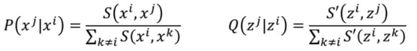
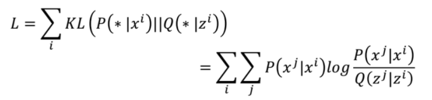
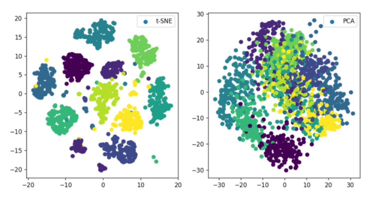

# t-SNE
论文链接：http://www.jmlr.org/papers/volume9/vandermaaten08a/vandermaaten08a.pdf  

t-SNE(t-distributed stochastic neighbor embedding)是用于降维的一种机器学习算法，是由 Laurens van der Maaten 和 Geoffrey Hinton在08年提出来。此外，t-SNE 是一种非线性降维算法，非常适用于高维数据降维到2维或者3维，进行可视化。

相对于PCA来说，t-SNE可以说是一种更高级有效的方法。

## 原理
t-SNE是一种降维算法，目的就是把X(原始高维数据)转换成Z(指定低维度的数据)。t-SNE首先将距离转换为条件概率来表达点与点之间的相似度，距离通过欧式距离算得,)表示求  之间的欧式距离。计算原始高维数据X与转换后的低维数据Z的公式如下所示。  
  
计算完X数据之间的的概率)和Z数据之间的概率)之后，接下来就是我们 的目的就是P和Q连个分布尽可能的接近，也就是要是如下公式的KL散度尽可能小。  

## 在手写字体上和PCA对比

	from sklearn.manifold import TSNE
	from sklearn.datasets import load_iris,load_digits
	from sklearn.decomposition import PCA
	import matplotlib.pyplot as plt
	import os
	
	digits = load_digits()
	X_tsne = TSNE(n_components=2,random_state=33).fit_transform(digits.data)
	X_pca = PCA(n_components=2).fit_transform(digits.data)
	
	ckpt_dir="images"
	if not os.path.exists(ckpt_dir):
	    os.makedirs(ckpt_dir)
	
	plt.figure(figsize=(10, 5))
	plt.subplot(121)
	plt.scatter(X_tsne[:, 0], X_tsne[:, 1], c=digits.target,label="t-SNE")
	plt.legend()
	plt.subplot(122)
	plt.scatter(X_pca[:, 0], X_pca[:, 1], c=digits.target,label="PCA")
	plt.legend()
	plt.savefig('images/digits_tsne-pca.png', dpi=120)
	plt.show()

